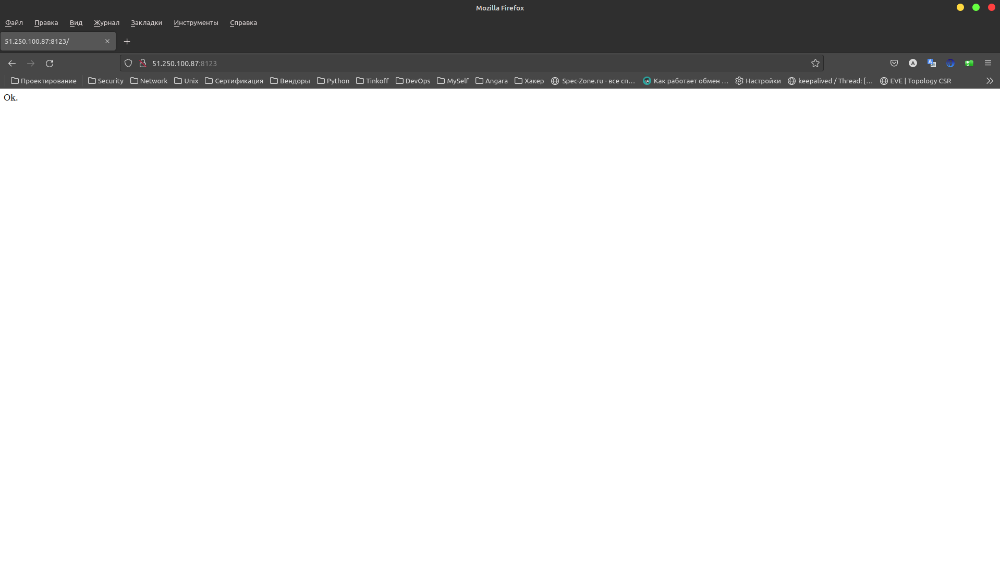
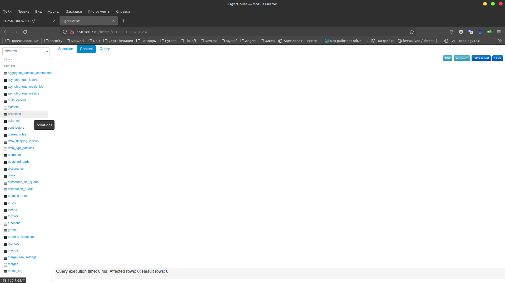

# Домашнее задание к занятию "08.03 Использование Yandex Cloud"

## Подготовка к выполнению

1. (Необязательно) Познакомтесь с [lighthouse](https://youtu.be/ymlrNlaHzIY?t=929)
2. Подготовьте в Yandex Cloud три хоста: для `clickhouse`, для `vector` и для `lighthouse`.

Ссылка на репозиторий LightHouse: https://github.com/VKCOM/lighthouse

## Основная часть

1. Допишите playbook: нужно сделать ещё один play, который устанавливает и настраивает lighthouse.

---

```yml
- name: Install Lighthouse
  hosts: lighthouse
  handlers:
    - name: reload-nginx
      become: true
      command: nginx -s reload
  pre_tasks:
    - name: Lighthouse | Install Git
      become: true
      ansible.builtin.yum:
        name: git
        state: present
  tasks:
    - name: Lighthouse | Copy from github
      git:
        repo: "{{ lighthouse_vcs }}"
        version: master
        dest: "{{ lighthouse_location_dir }}"
    - name: Lighthouse | Create lighthouse vector_config
      become: true
      template:
        src: lighthouse.conf.j2
        dest: /etc/nginx/conf.d/default.conf
        mode: 0644
      notify: reload-nginx
```
---

2. При создании tasks рекомендую использовать модули: `get_url`, `template`, `yum`, `apt`.

---

```yml
tasks:
    - block:
      - name: "Get {{ clickhouse_packages | flatten(1) }} distrib"
        ansible.builtin.get_url:
        ...
      rescue:
        - name: Get Clickhouse distrib
          ansible.builtin.get_url:
          ...
    - name: Install Clickhouse Packages
      become: true
      ansible.builtin.yum:
      ...
- name: Vector | Install rpm
  hosts: vector
  tasks:
    - name: Vector | Template Config
      ansible.builtin.template:
        ...
```

---

3. Tasks должны: скачать статику lighthouse, установить nginx или любой другой webserver, настроить его конфиг для открытия lighthouse, запустить webserver.

---
```yml
- name: Install Nginx
  # К каким хостам применяем данный play
  hosts: lighthouse
  handlers:
  # Запускаем Веб-сервер Nginx
    - name: start-nginx
      become: true
      command: nginx
  # Перезапускаем Веб-сервер Nginx
    - name: reload-nginx
      become: true
      command: nginx -s reload
  tasks:
    - name: NGINX | Install epel-release
      become: true
      ansible.builtin.yum:
        name: epel-release
        state: present
    - name: NGINX | Install NGINX
      become: true
      ansible.builtin.yum:
        name: nginx
        state: present
    - name: NGINX | Create Config
      become: true
      template:
        src: nginx.conf.j2
        dest: /etc/nginx/nginx.conf
        mode: 0644
      notify: start-nginx
```
---

4. Приготовьте свой собственный inventory файл `prod.yml`.

---
```yml
---
clickhouse:
  hosts:
    clickhouse-01:
      ansible_host: 158.160.44.156
      ansible_user: cisco
lighthouse:
  hosts:
    lighthouse-01:
      ansible_host: 158.160.35.217
      ansible_user: cisco
vector:
  hosts:
    vector-01:
      ansible_host: 158.160.34.185      
      ansible_user: cisco
```
---

5. Запустите `ansible-lint site.yml` и исправьте ошибки, если они есть.

---
```bash
cisco@ubuntu:~/repo/DevOps/CI/08-ansible-03-yandex$ ansible-lint site.yml
cisco@ubuntu:~/repo/DevOps/CI/08-ansible-03-yandex$
```
---

6. Попробуйте запустить playbook на этом окружении с флагом `--check`.

---
```bash
cisco@ubuntu:~/repo/DevOps/CI/08-ansible-03-yandex$ ansible-playbook -i inventory/prod.yml site.yml --check

PLAY [Install Nginx] ********************************************************************************************************************************************************************************

TASK [Gathering Facts] ******************************************************************************************************************************************************************************
ok: [lighthouse-01]

TASK [NGINX | Install epel-release] *****************************************************************************************************************************************************************
ok: [lighthouse-01]

TASK [NGINX | Install NGINX] ************************************************************************************************************************************************************************
ok: [lighthouse-01]

TASK [NGINX | Create Config] ************************************************************************************************************************************************************************
ok: [lighthouse-01]

PLAY [Install Lighthouse] ***************************************************************************************************************************************************************************

TASK [Gathering Facts] ******************************************************************************************************************************************************************************
ok: [lighthouse-01]

TASK [Lighthouse | Install Git] *********************************************************************************************************************************************************************
ok: [lighthouse-01]

TASK [Lighthouse | Copy from github] ****************************************************************************************************************************************************************
ok: [lighthouse-01]

TASK [Lighthouse | Create lighthouse vector_config] *************************************************************************************************************************************************
ok: [lighthouse-01]

PLAY [Install Clickhouse] ***************************************************************************************************************************************************************************

TASK [Gathering Facts] ******************************************************************************************************************************************************************************
ok: [clickhouse-01]

TASK [Get ['clickhouse-client', 'clickhouse-server', 'clickhouse-common-static'] distrib] ***********************************************************************************************************
ok: [clickhouse-01] => (item=clickhouse-client)
ok: [clickhouse-01] => (item=clickhouse-server)
failed: [clickhouse-01] (item=clickhouse-common-static) => {"ansible_loop_var": "item", "changed": false, "dest": "./clickhouse-common-static-22.3.3.44.rpm", "elapsed": 0, "gid": 1000, "group": "lex", "item": "clickhouse-common-static", "mode": "0664", "msg": "Request failed", "owner": "lex", "response": "HTTP Error 404: Not Found", "secontext": "unconfined_u:object_r:user_home_t:s0", "size": 246310036, "state": "file", "status_code": 404, "uid": 1000, "url": "https://packages.clickhouse.com/rpm/stable/clickhouse-common-static-22.3.3.44.noarch.rpm"}

TASK [Get Clickhouse distrib] ***********************************************************************************************************************************************************************
ok: [clickhouse-01]

TASK [Install Clickhouse Packages] ******************************************************************************************************************************************************************
ok: [clickhouse-01]

TASK [Flush handlers] *******************************************************************************************************************************************************************************

TASK [Create database] ******************************************************************************************************************************************************************************
skipping: [clickhouse-01]

PLAY [Vector | Install rpm] *************************************************************************************************************************************************************************

TASK [Gathering Facts] ******************************************************************************************************************************************************************************
ok: [vector-01]

TASK [Install Vector] *******************************************************************************************************************************************************************************
ok: [vector-01]

TASK [Vector | Template Config] *********************************************************************************************************************************************************************
An exception occurred during task execution. To see the full traceback, use -vvv. The error was: ansible.errors.AnsibleError: template error while templating string: expected token 'name', got '|'. String: {{ vector_config || to_nice_yaml }}
fatal: [vector-01]: FAILED! => {"changed": false, "msg": "AnsibleError: template error while templating string: expected token 'name', got '|'. String: {{ vector_config || to_nice_yaml }}"}

PLAY RECAP ******************************************************************************************************************************************************************************************
clickhouse-01              : ok=3    changed=0    unreachable=0    failed=0    skipped=1    rescued=1    ignored=0   
lighthouse-01              : ok=8    changed=0    unreachable=0    failed=0    skipped=0    rescued=0    ignored=0   
vector-01                  : ok=2    changed=0    unreachable=0    failed=1    skipped=0    rescued=0    ignored=0   
 
```

**TASK [Vector | Template Config]** данная таска вызывает ошибку и выполнение крашит выполненипе playbook. Как можно исправить данную ошибку.

---

7. Запустите playbook на `prod.yml` окружении с флагом `--diff`. Убедитесь, что изменения на системе произведены.

---
```yml
cisco@ubuntu:~/repo/DevOps/CI/08-ansible-03-yandex$ ansible-playbook -i inventory/prod.yml site.yml --diff

PLAY [Install Nginx] ********************************************************************************************************************************************************************************

TASK [Gathering Facts] ******************************************************************************************************************************************************************************
ok: [lighthouse-01]

TASK [NGINX | Install epel-release] *****************************************************************************************************************************************************************
ok: [lighthouse-01]

TASK [NGINX | Install NGINX] ************************************************************************************************************************************************************************
ok: [lighthouse-01]

TASK [NGINX | Create Config] ************************************************************************************************************************************************************************
ok: [lighthouse-01]

PLAY [Install Lighthouse] ***************************************************************************************************************************************************************************

TASK [Gathering Facts] ******************************************************************************************************************************************************************************
ok: [lighthouse-01]

TASK [Lighthouse | Install Git] *********************************************************************************************************************************************************************
ok: [lighthouse-01]

TASK [Lighthouse | Copy from github] ****************************************************************************************************************************************************************
ok: [lighthouse-01]

TASK [Lighthouse | Create lighthouse vector_config] *************************************************************************************************************************************************
--- before: /etc/nginx/conf.d/default.conf
+++ after: /home/cisco/.ansible/tmp/ansible-local-2265760hi8j8w6/tmpu4n9cim0/lighthouse.conf.j2
@@ -1,6 +1,8 @@
 server {
     listen          80;
     server_name     localhost;
+
+    access_log      /var/log/nginx/lighthouse_access.log main;
 
     location / {
         root    /home/cisco/lighthouse;

changed: [lighthouse-01]

RUNNING HANDLER [reload-nginx] **********************************************************************************************************************************************************************
changed: [lighthouse-01]

PLAY [Install Clickhouse] ***************************************************************************************************************************************************************************

TASK [Gathering Facts] ******************************************************************************************************************************************************************************
ok: [clickhouse-01]

TASK [Get ['clickhouse-client', 'clickhouse-server', 'clickhouse-common-static'] distrib] ***********************************************************************************************************
ok: [clickhouse-01] => (item=clickhouse-client)
ok: [clickhouse-01] => (item=clickhouse-server)
failed: [clickhouse-01] (item=clickhouse-common-static) => {"ansible_loop_var": "item", "changed": false, "dest": "./clickhouse-common-static-22.3.3.44.rpm", "elapsed": 0, "gid": 1000, "group": "alex", "item": "clickhouse-common-static", "mode": "0664", "msg": "Request failed", "owner": "alex", "response": "HTTP Error 404: Not Found", "secontext": "unconfined_u:object_r:user_home_t:s0", "size": 246310036, "state": "file", "status_code": 404, "uid": 1000, "url": "https://packages.clickhouse.com/rpm/stable/clickhouse-common-static-22.3.3.44.noarch.rpm"}

TASK [Get Clickhouse distrib] ***********************************************************************************************************************************************************************
ok: [clickhouse-01]

TASK [Install Clickhouse Packages] ******************************************************************************************************************************************************************
ok: [clickhouse-01]

TASK [Flush handlers] *******************************************************************************************************************************************************************************

TASK [Create database] ******************************************************************************************************************************************************************************
ok: [clickhouse-01]

PLAY [Vector | Install rpm] *************************************************************************************************************************************************************************

TASK [Gathering Facts] ******************************************************************************************************************************************************************************
ok: [vector-01]

TASK [Install Vector] *******************************************************************************************************************************************************************************
ok: [vector-01]

TASK [Vector | Template Config] *********************************************************************************************************************************************************************
ok: [vector-01]

TASK [Vector | Create systemd unit] *****************************************************************************************************************************************************************
ok: [vector-01]

TASK [Vector | Start Service] ***********************************************************************************************************************************************************************
ok: [vector-01]

PLAY RECAP ******************************************************************************************************************************************************************************************
clickhouse-01              : ok=4    changed=0    unreachable=0    failed=0    skipped=0    rescued=1    ignored=0   
lighthouse-01              : ok=9    changed=2    unreachable=0    failed=0    skipped=0    rescued=0    ignored=0   
vector-01                  : ok=5    changed=0    unreachable=0    failed=0    skipped=0    rescued=0    ignored=0   

```
---

8. Повторно запустите playbook с флагом `--diff` и убедитесь, что playbook идемпотентен.

---
```yml
cisco@ubuntu:~/repo/DevOps/CI/08-ansible-03-yandex$ ansible-playbook -i inventory/prod.yml site.yml --diff

PLAY [Install Nginx] ********************************************************************************************************************************************************************************

TASK [Gathering Facts] ******************************************************************************************************************************************************************************
ok: [lighthouse-01]

TASK [NGINX | Install epel-release] *****************************************************************************************************************************************************************
ok: [lighthouse-01]

TASK [NGINX | Install NGINX] ************************************************************************************************************************************************************************
ok: [lighthouse-01]

TASK [NGINX | Create Config] ************************************************************************************************************************************************************************
ok: [lighthouse-01]

PLAY [Install Lighthouse] ***************************************************************************************************************************************************************************

TASK [Gathering Facts] ******************************************************************************************************************************************************************************
ok: [lighthouse-01]

TASK [Lighthouse | Install Git] *********************************************************************************************************************************************************************
ok: [lighthouse-01]

TASK [Lighthouse | Copy from github] ****************************************************************************************************************************************************************
ok: [lighthouse-01]

TASK [Lighthouse | Create lighthouse vector_config] *************************************************************************************************************************************************
ok: [lighthouse-01]

PLAY [Install Clickhouse] ***************************************************************************************************************************************************************************

TASK [Gathering Facts] ******************************************************************************************************************************************************************************
ok: [clickhouse-01]

TASK [Get ['clickhouse-client', 'clickhouse-server', 'clickhouse-common-static'] distrib] ***********************************************************************************************************
ok: [clickhouse-01] => (item=clickhouse-client)
ok: [clickhouse-01] => (item=clickhouse-server)
failed: [clickhouse-01] (item=clickhouse-common-static) => {"ansible_loop_var": "item", "changed": false, "dest": "./clickhouse-common-static-22.3.3.44.rpm", "elapsed": 0, "gid": 1000, "group": "alex", "item": "clickhouse-common-static", "mode": "0664", "msg": "Request failed", "owner": "alex", "response": "HTTP Error 404: Not Found", "secontext": "unconfined_u:object_r:user_home_t:s0", "size": 246310036, "state": "file", "status_code": 404, "uid": 1000, "url": "https://packages.clickhouse.com/rpm/stable/clickhouse-common-static-22.3.3.44.noarch.rpm"}

TASK [Get Clickhouse distrib] ***********************************************************************************************************************************************************************
ok: [clickhouse-01]

TASK [Install Clickhouse Packages] ******************************************************************************************************************************************************************
ok: [clickhouse-01]

TASK [Flush handlers] *******************************************************************************************************************************************************************************

TASK [Create database] ******************************************************************************************************************************************************************************
ok: [clickhouse-01]

PLAY [Vector | Install rpm] *************************************************************************************************************************************************************************

TASK [Gathering Facts] ******************************************************************************************************************************************************************************
ok: [vector-01]

TASK [Install Vector] *******************************************************************************************************************************************************************************
ok: [vector-01]

TASK [Vector | Template Config] *********************************************************************************************************************************************************************
ok: [vector-01]

TASK [Vector | Create systemd unit] *****************************************************************************************************************************************************************
ok: [vector-01]

TASK [Vector | Start Service] ***********************************************************************************************************************************************************************
ok: [vector-01]

PLAY RECAP ******************************************************************************************************************************************************************************************
clickhouse-01              : ok=4    changed=0    unreachable=0    failed=0    skipped=0    rescued=1    ignored=0   
lighthouse-01              : ok=8    changed=0    unreachable=0    failed=0    skipped=0    rescued=0    ignored=0   
vector-01                  : ok=5    changed=0    unreachable=0    failed=0    skipped=0    rescued=0    ignored=0   

alex@AlexPC:~/GitHub/DevOps/CI/08-ansible-03-yandex$
```
---

9.  Подготовьте README.md файл по своему playbook. В нём должно быть описано: что делает playbook, какие у него есть параметры и теги.

## **Clickhouse**

<p align="center">
  
</p>

## **Lighhouse**

<p align="center">
  
</p>


10. Готовый playbook выложите в свой репозиторий, поставьте тег `08-ansible-03-yandex` на фиксирующий коммит, в ответ предоставьте ссылку на него.
